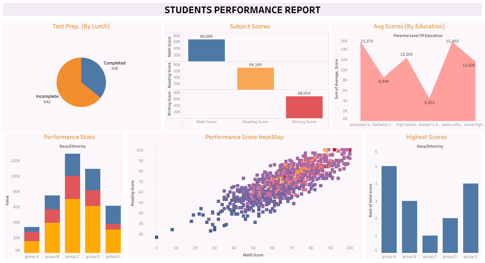

# Student Performance Report

A concise archive for ITSEC Data Science training materials, including Jupyter notebooks, Tableau dashboards, and reports.

## Project Structure

- **Jupyter Notebooks**: Contains interactive notebooks for data analysis and reporting.
	- `Students-Report.ipynb`: Main notebook for student performance analysis.
- **Tableau Workbooks**: Tableau dashboard files for visualizing student performance.
	- `Tableau-Students-Perf-Report.twbx`
- **images**: Visual assets used in reports and dashboards.
	- `dashboard.png`: Example dashboard screenshot (see below).
- **Students-Report.html**: Exported HTML report from the notebook.

## Dashboard Preview

## Usage

1. Open the Jupyter notebook in `Jupyter Notebooks/` for analysis and reporting.
2. Use Tableau workbook in `Tableau Workbooks/` for interactive dashboards.
3. Refer to the HTML report for a static summary.
